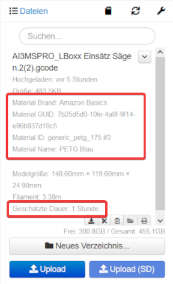

# Slicer Estimator is a generic implementation to read remaining time to print and custom metadata embedded in the GCODE file by the slicer
With this plugin you can use the more accurate estimation of the slicer instead of OctoPrints estimations. So it will be very accurate, as the slicer created each command of the GCODE. 
Also you can add custom metadata that will be added to the filebrowser to get e.g. the material the GCODE was created for.

The slicer is detected automatically, the default configurations supports the following slicers. Also you can add custom settings according your needs for other slicers or requirements. 

* Cura
* Cura M117
* Simplify3D
* PrusaSlicer

# Estimation
Slicer Estimator detected the embedded remaining time if there is a checkmark right of the estimation:

Also the estimated time of an upload is updated if slicer comments are found. It is possible to deactivate this in the settings if perhaps another plugin is installed doing this.

# Custom metadata
From version 1.1.0 custom metadata is supported. Comments in GCODE that can be generated by the Slicer (like material brand,... ) and are added to the filelist or printer state. You can see now for which material the GCODE was created.

The following has to be added in the Start GCODE (`;Slicer info:<key>;<value>`). You can add as much metadata as you like and decide to view the metadata in the filelist or printer state. **Systax changed from version 1.3.0 as the description is maintanined in settings now but old styles are still supported.**

Example for Cura 4.12 and newer (For Anycubic Mega S, Pro and X it is available by default in the default Start GCODE. You can download an actual [printer profile here](https://github.com/NilsRo/Cura_Anycubic_MegaS_Profile))

    ;Slicer info:material_guid;{material_guid}
    ;Slicer info:material_id;{material_id}
    ;Slicer info:material_brand;{material_brand}
    ;Slicer info:material_name;{material_name}

Settings for metadata configuration

## API - for other plugin developers
Metadata stored can be easily used by other plugins. [An API description is available here](API_DOC.md).

## Slicers supported

### Cura
With Cura native no changes has to be applied to Cura. The overall print time is read out of a comment in the GCODE. For a correct estimation OctoPrints percentage done is used as there is only the overall print time available.

Custom metadata: http://files.fieldofview.com/cura/Replacement_Patterns.html

### Cura M117
Remaining time is read out of M117 commands added by Cura if the Post-Processing actions are activated. The slicer will update the remaining print time continuously. Also there is support to show the remaining times to filamnt changes.

### Simplify3D
With Simplify3D no changes has to be applied to Simplify3D. The overall print time is read out of a comment in the GCODE. For a correct estimation OctoPrints percentage done is used as there is only the overall print time available.

### PrusaSlicer
Remaining time is read out of M73 commands added by PrusaSlicer. The slicer will update the remaining print time continuously. Also there is support to show the remaining times to filamnt changes.

## Notes
 * If no slicer is detected the original estimator from OctoPrint will be used.
 * In case SDCARD print is used the original estimator from OctoPrint will be used
 * Compared to slicer estimations the average estimation by OctoPrint (based on the average of the last real prints) could be more accurate. So you can change the settings if you like to use average estimation if available. It is not available for new GCODE files and could be slightly off if you preheat "sometimes". A green dot is shown if average estimation is used.
 * GCODE files are scanned in background so until the necessary information is found the OctoPrint estimator is used. There is no delay in start printing but with files of e.g. 150Mbyte in size the scan could take some seconds.
 * If you like to see more details what happens in the background simply activate DEBUG mode in OctoPrint logging for the plugin. If you want open a ticket please attach the log there.
 * Be aware that other plugins could change the GCODE. This could interfere with Slicer Estimator if Cura M117 or PrusaSlicer is used. Both reads GCODEs that perhaps will be overwritten by e.g. an ETA plugin.
 * Also adding e.g. linear advance to Cura in post processing will lead to a lower estimation as Cura does not know the changes done.
 * Filament change time is supported with M117 or M73 commands only as actually it is not possible to derive the correct progress the M600 command is found in the GCODE.

## Custom Settings
Example: For the following command "M117 100% Remaining 1 weeks 6 days ( 07:54:19 )" you can use RegEx "M117 .+ Remaining ([0-9]+) weeks.+" with Match 1 to get the weeks. To get the minutes you should use "M117 .+ Remaining .+\( ([0-9]+):([0-9]+):([0-9]+) \)" and Match 2 to avoid an issue if weeks are not shown. 

 

I like to suggest regex101.com for testing and to get the right match group.

